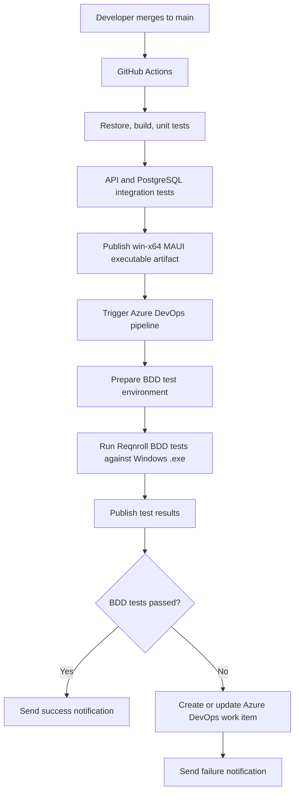

# OpsLedger

OpsLedger is a compact on-premise C#/.NET MAUI service request tracker that demonstrates a production-style testing and delivery feedback loop around a deliberately small fullstack desktop application.

The application itself is intentionally focused: employees submit internal service requests, operators triage and resolve them, and PostgreSQL stores the request workflow. The main portfolio focus is the engineering system around it: unit tests, integration tests, Gherkin-based BDD validation, GitHub Actions CI, Azure DevOps orchestration, notifications, and automated defect ticket creation.

## Architecture

## Planned Stack

- .NET 8 or later
- C#
- .NET MAUI
- ASP.NET Core
- PostgreSQL
- Stored procedures with transactions
- EF Core with the Npgsql PostgreSQL provider
- xUnit or NUnit
- FluentAssertions
- Reqnroll for Gherkin/BDD tests
- GitHub Actions
- Azure DevOps Pipelines
- PowerShell
- Azure DevOps REST API
- Teams Workflows webhook or email notification

## Project Flow

1. Build OpsLedger as a small C#/.NET MAUI desktop app using TDD for UI-independent request workflow logic.
2. Add an ASP.NET Core API and PostgreSQL persistence layer.
3. Use stored procedures with transactions for request state changes.
4. Add unit tests for fast business-rule validation.
5. Add integration tests for API, PostgreSQL, stored procedures, and transaction behavior.
6. Publish the app locally for Apple Silicon through the MAUI Mac Catalyst arm64 target and in CI as a `win-x64` executable artifact.
7. Add Reqnroll BDD scenarios that run against the built artifact and backend.
8. Use GitHub Actions for restore, build, test, and artifact publishing.
9. Trigger Azure DevOps from `main` builds.
10. Run BDD validation in Azure DevOps.
11. Publish results, send notifications, and create deduplicated work items for failed scenarios.

## Current Status

This repository is in the planning and scaffolding phase. The project documentation now targets OpsLedger as a .NET MAUI, ASP.NET Core, and PostgreSQL on-premise application; the solution and CI/CD implementation are next.

## Documentation

Detailed planning and workflow docs live in `docs/`, including:

- `PLAN.md`
- `MILESTONES.md`
- `PROJECT_STATE.md`
- `ARCHITECTURE_OVERVIEW.md`
- `AGENT_WORKFLOW.md`
- `EXTERNAL_SETUP.md`
