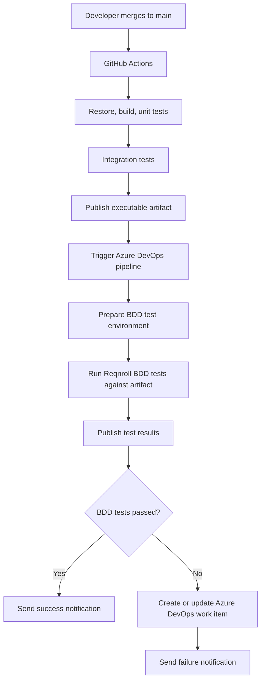

# .NET Quality Feedback Pipeline

A compact C#/.NET project that demonstrates a production-style testing and delivery feedback loop around a deliberately small console application.

The application itself is intentionally simple. The main focus is the engineering system around it: unit tests, integration tests, Gherkin-based BDD validation, GitHub Actions CI, Azure DevOps orchestration, notifications, and automated defect ticket creation.

## Architecture

## Planned Stack

- .NET 8 or later
- C#
- xUnit or NUnit
- FluentAssertions
- Reqnroll for Gherkin/BDD tests
- GitHub Actions
- Azure DevOps Pipelines
- PowerShell
- Azure DevOps REST API
- Teams Workflows webhook or email notification

## Project Flow

1. Build a small C# console app using TDD.
2. Add unit tests for fast business-rule validation.
3. Add integration tests for realistic boundaries.
4. Publish the app as an executable artifact.
5. Add Reqnroll BDD scenarios that run against the built artifact.
6. Use GitHub Actions for restore, build, test, and artifact publishing.
7. Trigger Azure DevOps from `main` builds.
8. Run BDD validation in Azure DevOps.
9. Publish results, send notifications, and create deduplicated work items for failed scenarios.

## Current Status

This repository is in the planning and scaffolding phase. The project documentation and agent workflow files have been created; the .NET solution and CI/CD implementation are next.

## Documentation

Detailed planning and workflow docs live in `docs/`, including:

- `PLAN.md`
- `MILESTONES.md`
- `PROJECT_STATE.md`
- `ARCHITECTURE_OVERVIEW.md`
- `AGENT_WORKFLOW.md`

